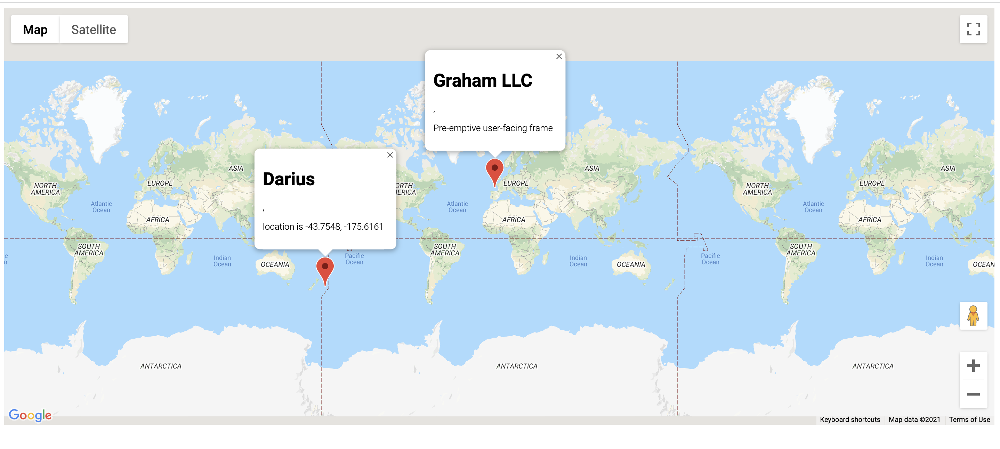

# Display Locations of User and Company built with GoogleMap API and TypeScript

## About the Project
I built this simple application that displays user and company locations with GoogleMap JavaScript API and TypeScript. 

- Added three classes: User, Company, customMap
- Created an interface, 'Mappable' to use it as a type of an argument for addMarker method of CustomMap
- User and Company classes implement 'Mappable' interface to make sure their instance object, which will be passed to addMaker method respectively as an argument, meet the interface that has location property and markerContent method

A list of commonly used resources that I find helpful is listed in the acknowledgments.

## Built With
* [TypeScript](https://www.typescriptlang.org/)
* [GoogleMap JavaScript API](https://developers.google.com/maps/documentation/javascript/overview)

## Getting Started
To get a local copy up and running follow these simple example steps.

1. On the project GitHub page, navigate to the main page of the repository.
2. Under the repository name, locate and click on a green button named `Code`. 
3. Copy the project URL as displayed.
4. If you're running the Windows Operating System, open your command prompt. On Linux, Open your terminal. 
5. Change the current working directory to the location where you want the cloned directory to be made. Leave as it is if the current location is where you want the project to be. 
6. Type git clone, and then paste the URL you copied in Step 3.  
e.g. $ git clone https://github.com/yourUsername/yourProjectName 
7. Press Enter. Your local copy will be created. 
8. To run the server, install parcel bundler like `npm install -g parcel bundler`, and run `parcel index.html`

## Author

👤 **Yoko Saka**

- GitHub: [@yocosaka](https://github.com/yocosaka)
- Twitter: [@yocosaka](https://twitter.com/yocosaka)
- LinkedIn: [Yoko Saka](https://www.linkedin.com/in/yokosaka)

## Contributing

Contributions, issues, and feature requests are welcome!
Feel free to check the [issues page](../../issues).

1. Fork the Project
2. Create your Feature Branch (`git checkout -b feature/AmazingFeature`)
3. Commit your Changes (`git commit -m 'Add some AmazingFeature'`)
4. Push to the Branch (`git push origin feature/AmazingFeature`)
5. Open a Pull Request

## Show your support

Give a ⭐️ if you like this project!

## License

This project was built by following [Typescript: The Complete Developer's Guide](https://www.udemy.com/course/typescript-the-complete-developers-guide/) produced by [Stephen Grider](https://www.udemy.com/user/sgslo/)

## Acknowledgements
* [faker](https://www.npmjs.com/package/faker)
* [@types/faker](https://www.npmjs.com/package/@types/faker)
* [parcel](https://parceljs.org/)
